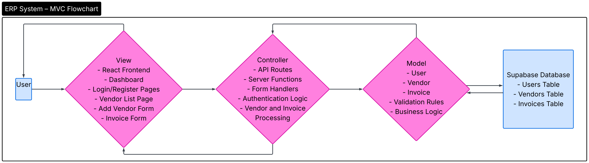
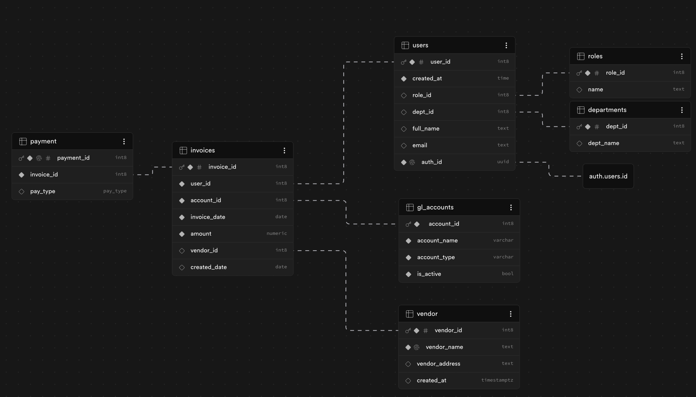
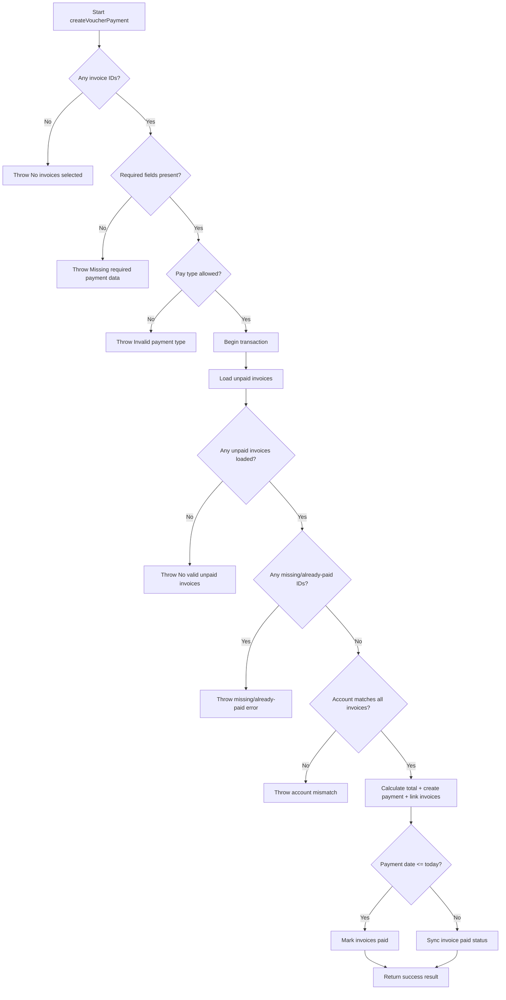

# ERP Accounting System
Advanced Software Engineering  Team:
Scott Schmidt, DaShawn Pfeifer, SeEun Chung, Suphanat Rojsiristith, Walter Zou

MVC is Model-View-Controller which is a way to organize your code into 3 roles. 
1. Model (Data) handles the database and data structure such as the tables users, invoices, and vendor.
2. View (UI) is what the user sees such as forms and the dashboards.
Example: Box Layout or Gidlayout 
3. Controller connects the model and view. 
Examples: mousePressed()

## Architecture Diagram
Here is our diagram MVC image below:
# Software Architecture Template (MVC + Layered / N-tier)

# ERP Accounting System
Advanced Software Engineering  Team: 
Scott Schmidt, DaShawn Pfeifer, SeEun Chung, Suphanat Rojsiristith, Walter Zou

MVC is Model-View-Controller which is a way to organize your code into 3 roles. 
1. Model (Data) handles the database and data structure such as the tables users, invoices, and vendor.
2. View (UI) is what the user sees such as forms and the dashboards.
Example: Box Layout or Gidlayout 
3. Controller connects the model and view. 
Examples: mousePressed()

## Architecture Diagram
Here is our diagram MVC image below:

## Data Flow Between Layers
When a user interacts with the system (e.g., submits a form), the request starts in the Presentation Layer. The request is then passed to the Application Layer, where business logic and authentication are applied. The Application Layer communicates with the Data Layer to store or retrieve information from the database. The result is then returned back through the Application Layer to the Presentation Layer, where it is displayed to the user.

## Layer 1: Presentation Layer

-Component1: Index
Example: Display main content of application
- Component 2:  Header
Examples: Logo, title, navigation
- Component 3:  Navigation
Examples: Menus and forms
- Component 4:  Route Pages

## Layer 2: Application Layer
This is the “bain” of the application that contains business logic, rules, and actions:
- Component 4: CreateInvoice
- Component 5: CreateUser
- Component 6: getVendors
- Component 7: Login and Logout

## Layer 3: Data Layer
- Component 6: Supabase Database 
Here are the tables, columns and connections in Supabase:

---

## MVC Mapping

- **View:** React UI components such as Dashboard, Login/Register pages, Vendor List page, Add Vendor form, and Invoice form
- **Controller:** API routes and server functions including form handlers, authentication logic, and request processing
- **Model:** Database models and schemas such as User, Vendor, and Invoice using Supabase

---

## Component Communication

1.The invoice page sends form data (vendor, date, amount) to the createInvoice function.
2. CreateInvoice checks the user and saves the invoice to the database.
3.The database saves the invoice and sends the result back.
4. The page shows success and redirects to the invoice list.

---

## Testing

### Formal Test Plan Table

| Class/Method | Test Type | Requirement Tested | Mock Used | Expected Result |
|---|---|---|---|---|
| `VendorService.createVendor()` | Black-box unit | `RQ-VEN-01`: Reject blank vendor name | `FakeVendorRepository` | Throws `Vendor name is required.` |
| `VendorService.createVendor()` | Black-box unit | `RQ-VEN-02`: Create vendor with normalized address | `FakeVendorRepository` | Returns `created=true`, address assembled correctly |
| `VendorService.createVendor()` | Black-box unit | `RQ-VEN-03`: Prevent duplicate vendor insert by name | `FakeVendorRepository` | Returns existing vendor, `created=false` |
| `InvoiceService.calculateTotals()` | Black-box unit | `RQ-INV-01`: Compute subtotal/tax/total from line items | None | Correct monetary totals returned |
| `InvoiceService.validateLineItems()` | Black-box unit | `RQ-INV-02`: Validate invalid line items | None | Returns descriptive validation errors |
| `InvoiceApplicationService.createInvoiceForUser()` | Black-box unit | `RQ-INV-03`: Persist invoice using computed total only | `FakeInvoiceRepository` | Repository receives computed `amount` |
| `PaymentService.createVoucherPayment()` | Black-box unit | `RQ-PAY-01`: Fail when no invoices selected | `FakePaymentRepository` | Throws `No invoices selected.` |
| `PaymentService.createVoucherPayment()` | Black-box unit | `RQ-PAY-02`: Fail when invoice missing/already paid | `FakePaymentRepository` | Throws missing/already-paid invoice error |
| `PaymentService.createVoucherPayment()` | Black-box unit | `RQ-PAY-03`: Successful voucher/payment creation and invoice paid update | `FakePaymentRepository` | Payment created, links inserted, invoices marked paid |

### Core Production Class Coverage

| Core Class | Covered by Tests | Test File |
|---|---|---|
| `VendorService` | Yes | `src/tests/vendor-service.test.ts` |
| `InvoiceService` | Yes | `src/tests/invoice-service.test.ts` |
| `InvoiceApplicationService` | Yes | `src/tests/invoice-service.test.ts` |
| `PaymentService` | Yes | `src/tests/payment-service.test.ts` |

### Black-box Unit Test Descriptions (Requirement Traceability)

- `RQ-VEN-01`: Vendor name cannot be blank; whitespace input fails.
- `RQ-VEN-02`: Valid vendor input creates a normalized address and returns `created=true`.
- `RQ-VEN-03`: Existing vendor name returns existing row (`created=false`) instead of reinserting.
- `RQ-INV-01`: Invoice totals are correctly computed from line items.
- `RQ-INV-02`: Invalid line-item fields return clear validation errors.
- `RQ-INV-03`: Invoice persistence uses computed total amount.
- `RQ-PAY-01`: Voucher creation fails when no invoices are selected.
- `RQ-PAY-02`: Missing or already-paid invoices are rejected.
- `RQ-PAY-03`: Successful voucher flow creates payment, links invoices, and updates paid status.

### White-box Test Section

White-box algorithm: `SandboxTransferEngine.transfer()` in `src/lib/banking/transfer.ts`.

White-box test file: `src/lib/banking/transfer.test.ts`.

This test covers the main decision paths of the transfer method:

- valid transfer with zero fee
- valid transfer with transfer fee
- transfer fails when funds are insufficient
- transfer fails when source and destination accounts are the same

Main branches:
1. `if (!invoiceIds.length)`
2. `if (!input.accountId || !input.paymentDate || !payType)`
3. `if (!ALLOWED_PAY_TYPES.has(payType))`
4. `if (!invoiceRows.length)`
5. `if (missingOrPaidIds.length)`
6. `if (accountMismatch)`
7. `if (shouldMarkInvoicesPaidNow(input.paymentDate))`

### CFG Diagram (Payment Voucher Algorithm)

### Cyclomatic Complexity

For `PaymentService.createVoucherPayment()`:

- Decision points = 7
- `V(G) = D + 1 = 7 + 1 = 8`

### Independent Paths

- `P1`: No invoice IDs -> error
- `P2`: Invoice IDs present but required fields missing -> error
- `P3`: Invalid pay type -> error
- `P4`: No unpaid invoice rows -> error
- `P5`: Missing/already-paid IDs detected -> error
- `P6`: Account mismatch -> error
- `P7`: Success path with `paymentDate <= today` -> mark paid -> success
- `P8`: Success path with `paymentDate > today` -> sync status -> success

---

## Notes

- Why this architecture fits the project: This architecture fits the project because it separates the user interface, business logic, and data management, making the ERP system easier to develop, test, and maintain.
- Any limitations/future improvements: A limitation is that the system can become more complex as the project grows, so future improvements could include clearer service separation, stronger validation, and better scalability support.